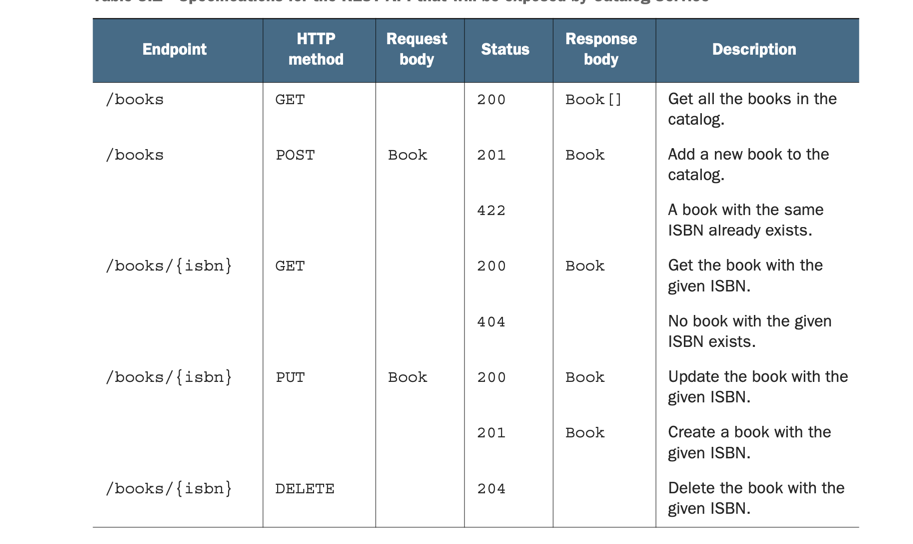
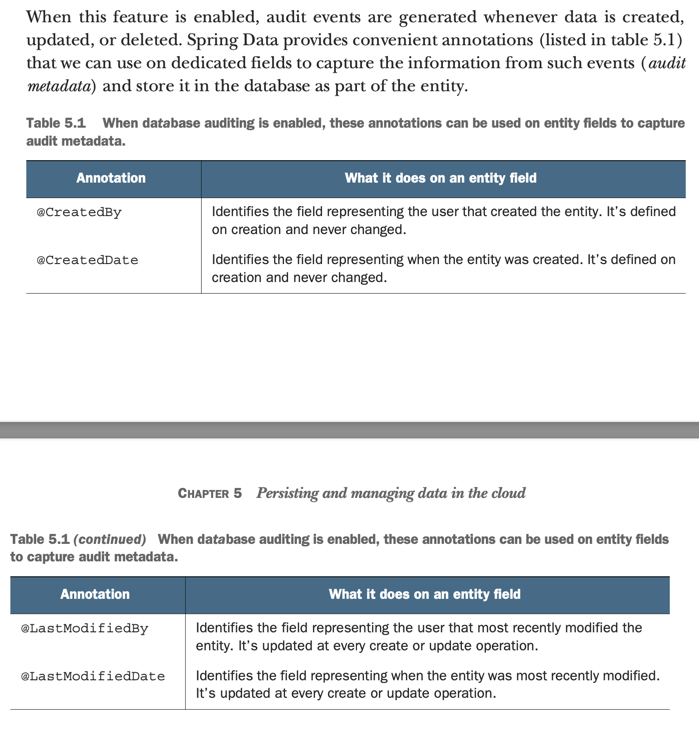

# Cloud Native Spring in Action With Spring Boot and Kubernetes notes


## Utility Commands for gradlew
pwd should be appplication root directory.

Boot the spring application with gradle.
```shell
./gradlew bootRun
```

Bootjar compiles and package the application as a jar file.
```shell
./gradlew bootjar
```
Then execute the jar file through java:
```shell
java -jar build/libs/catalog-service-0.0.1-SNAPSHOT.jar
```

<br>

---

### Test w gradle
The cli command below executes gradle test - run this to run test.
Reason behind the autogenerated test class with 
springboottest annotated is to test that the whole 
spring application can start up without any errors.
```shell
./gradlew test
```

<br>

---
### Use Of Docker

This command will clean up, as soon as container exits
it gets deleted.
``` shell
docker run --rm my-image
```

#### Building a Docker Image with Gradle and Spring Boot
When you run `./gradlew bootBuildImage`, Gradle goes through the following steps:

1. **Build the Project:**
   - Gradle first builds your Spring Boot project, compiling the source code, running tests, and assembling the necessary artifacts.

2. **Create a Docker Image:**
   - Once the project is built, the Spring Boot Gradle Plugin uses the Paketo Buildpacks to create a Docker image for your application. Buildpacks are a framework for transforming application source code into container images. They handle tasks such as dependency resolution, build, and configuration.

3. **Docker Image Configuration:**
   - The Docker image created is configured to run your Spring Boot application using the JAR file generated during the build. The image may include a minimal operating system layer, a JRE (Java Runtime Environment), and any dependencies needed by your application.

4. **Result:**
   - After the process completes, you will have a Docker image for your Spring Boot application that you can run using a container runtime like Docker.

```shell
./gradlew bootBuildImage
```
After the image is created execute this:
flag --plateform is because it's not supporting ARM64 yet
```shell
docker run --rm --name catalog-service -p 8080:8080 15cad --platform linux/amd64
```

To enter a running Docker container, you can use the docker exec command:

```bash
docker exec -it <container_name_or_id> /bin/bash
```

Booting up an postgreSQL container from dockerhub image:
```bash
docker run -d --name polar-postgres / 
-e POSTGRES_USER=user -e POSTGRES_PASSWORD=password /
-e POSTGRES_DB=polardb_catalog -p 5432:5432 postgres:14.1
```

<br>

---

### Using minikube for Kubernetes

```bash
brew install minikube
```

Running a local Kubernetes cluster with minikube 
requires a container runtime or a virtual machine manager. 
Since we are already using Docker, that’s what 
we’re going to use. Under the hood, any minikube 
cluster will run as a Docker container.
After installing minikube, you can start a new local 
Kubernetes cluster using the Docker driver.

The first time you run this command, it will take a 
few minutes to download all the components needed to 
run the cluster:
```bash
minikube start --driver=docker
```

I recommend making Docker the default driver for 
minikube by running the following command:
```bash
minikube config set driver docker
```

<br>

To interact with the newly created Kubernetes cluster, 
you need to install kubectl, the Kubernetes CLI. 
Installation instructions are available on the 
official website [Kubernetes Documentation](https://kubernetes.io/docs/tasks/tools). 
On macOS and Linux, you can install it with Home- brew 
as follows:
```bash
brew install kubectl
```

Then you can verify that the minikube cluster is 
started correctly and check that a node is running 
in your local cluster:
```bash 
kubectl get nodes
NAME       STATUS   ROLES                  AGE     VERSION
minikube   Ready    control-plane,master   2m20s   v1.24.3
```

I recommend stopping minikube whenever you don’t need 
it to free up resources in your local environment:
```bash
minikube stop
```
<br>

###### Docker-Based Approach:
Using Docker as the driver means Minikube creates 
a lightweight Kubernetes cluster directly inside 
a Docker container on your host machine. 
The cluster runs within the Docker environment 
without the need for a separate virtual machine. 
That is why hyperkit or something similar isn't needed.

Running catalog-service image as a container inside
minikube cluster, whihc mean it first have to be imported
into local cluster:

```bash
minikube image load catalog-service:0.0.1-SNAPSHOT
```

To achieve the cloud native goals, you want the platform
to take care of instantiating Pods so that if 
one goes down, it can be replaced by another one. 
What you need is a Deployment resource that will 
make Kubernetes create application instances 
as Pod resources.

From a Terminal window, run the following command:
```bash
kubectl create deployment catalog-service --image=catalog-service:0.0.1-SNAPSHOT
```

You can verify the creation of the Deployment object 
as follows:
```bash
kubectl get deployment
NAME              READY   UP-TO-DATE   AVAILABLE   AGE
catalog-service   1/1     1            1           7s
```
Behind the scenes, Kubernetes created a Pod 
for the application defined in the Deployment resource. 
You can verify the creation of the Pod object 
as follows:
```bash
kubectl get pod
NAME                               READY   STATUS    RESTARTS   AGE
catalog-service-5b9c996675-nzbhd   1/1     Running   0          21s
```

By default, applications running in Kubernetes are not 
accessible. Let’s fix that.
First, you can expose Catalog Service to the cluster 
through a Service resource by running 
the following command:
```bash
kubectl expose deployment catalog-service --name=catalog-service --port=8080
```
Exposing a service allows it to be accessible 
within the cluster or, optionally, from outside 
the cluster.

The Service object exposes the application to other 
components inside the cluster.

You can verify that it’s been created correctly 
with the following command:
```bash
kubectl get service catalog-service
NAME TYPE CLUSTER-IP EXTERNAL-IP PORT(S) AGE catalog-service ClusterIP 10.96.141.159 <none> 8080/TCP 7s
```

You can then forward the traffic from a local port on 
your computer (for example, 8000) to the port exposed 
by the Service inside the cluster (8080).
The output of the command will tell you if the 
port forwarding is configured correctly:
```bash
kubectl port-forward service/catalog-service 8000:8080
Forwarding from 127.0.0.1:8000 -> 8080
Forwarding from [::1]:8000 -> 8080
```

Clean-up / delete service and deployment from cluster:
```bash
kubectl delete service catalog-service   
service "catalog-service" deleted
kubectl delete deployment catalog-service
deployment.apps "catalog-service" deleted
```

<br>

---

## Testing
Red phase failing test -> green phase parsing test 
-> refactor phase.

To run a test class with gradle:
```bash
./gradlew test --tests BookValidationTests
```

<br>

---

## Documentation for REST API EXAMPLE


## Grype for vulnerability scan
Scanning builded application for vulnerabilities wth grype:
```shell
grype .

 ✔ Vulnerability DB                [updated]  
 ✔ Indexed file system                                                                                                                                                .
 ✔ Scanned for vulnerabilities     [2 vulnerability matches]  
   ├── by severity: 0 critical, 2 high, 0 medium, 0 low, 0 negligible
   └── by status:   2 fixed, 0 not-fixed, 0 ignored 
[0000]  WARN no explicit name and version provided for directory source, deriving artifact ID from the given path (which is not ideal)
NAME             INSTALLED  FIXED-IN  TYPE          VULNERABILITY        SEVERITY 
logback-classic  1.4.11     1.4.12    java-archive  GHSA-vmq6-5m68-f53m  High      
logback-core     1.4.11     1.4.12    java-archive  GHSA-vmq6-5m68-f53m  High
```


## Nice To Know
Github Actions workflows are runned on 
either windows, mac or linux servers 
-> they are called runners.

Dealing with environment variables they can be set
through CLI like the given command:
```bash
 POLAR_GREETING="Welcome FROM ENVIRONMENT" java -jar build/libs/catalog-service-0.0.1-SNAPSHOT.jar
 ```

To start application with defined profile:
```bash
java -jar build/lib/catalog-service-0.0.1-SNAPSHOT.jar --spring.profiles.active=prod
```

The annotation for records/intities `@Version` is used 
for optimistic locking so that the db can deal with 
concurrency related issues.

Database `auditing` is keeping track of when and who
edited the persisted data.
With spring the annotation `@EnableJdbcAuditing` which
can be used for a configuration class.
If using spring JPA instead of JdbcData use the annotation
`@EnableJpaAuditing` and also the entity class have to be
annotated with `@EntityListeners(AuditingEntityListener.class)`.



<br>

---

## Configurations
Relying on a config-repo pushed to Github and connected through config-service,
then making changes to the config-repo and pushing the changes. 
It is relevant to use Actuator to trigger a refresh
for all @ConfigurationProperties which happens through post request for: http://localhost:9001/actuator/refresh.
```bash
curl -X POST http://localhost:9001/actuator/refresh
```