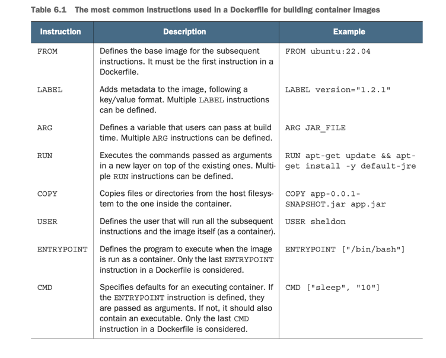
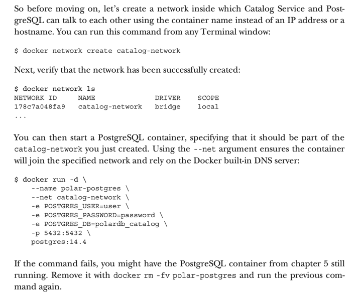
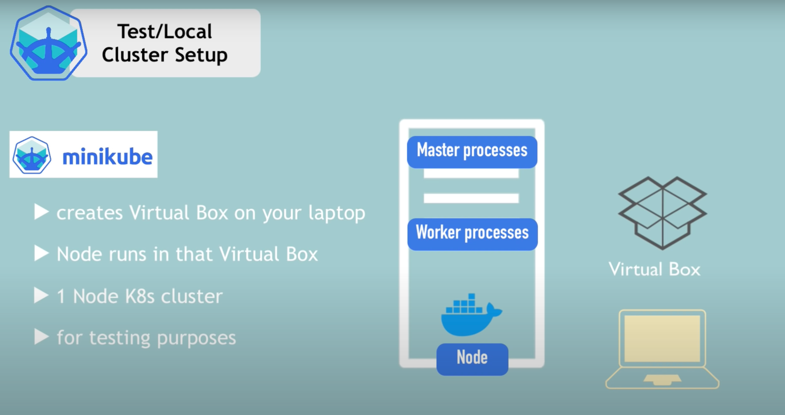
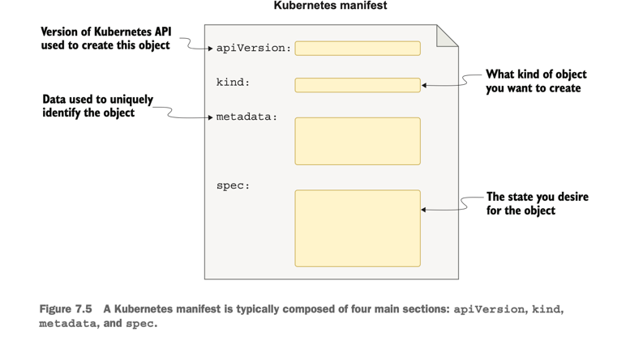

# Cloud Native Spring in Action With Spring Boot and Kubernetes notes


## Utility Commands for gradlew
pwd should be appplication root directory.

Boot the spring application with gradle.
```shell
./gradlew bootRun
```

Bootjar compiles and package the application as a jar file.
```shell
./gradlew bootjar
```
Then execute the jar file through java:
```shell
java -jar build/libs/catalog-service-0.0.1-SNAPSHOT.jar
```

<br>

---

### Test w gradle
The cli command below executes gradle test - run this to run test.
Reason behind the autogenerated test class with 
springboottest annotated is to test that the whole 
spring application can start up without any errors.
```shell
./gradlew test
```

<br>

---
### Use Of Docker

This command will clean up, as soon as container exits
it gets deleted.
``` shell
docker run --rm my-image
```

#### Building a Docker Image with Gradle and Spring Boot
When you run `./gradlew bootBuildImage`, Gradle goes through the following steps:

1. **Build the Project:**
   - Gradle first builds your Spring Boot project, compiling the source code, running tests, and assembling the necessary artifacts.

2. **Create a Docker Image:**
   - Once the project is built, the Spring Boot Gradle Plugin uses the Paketo Buildpacks to create a Docker image for your application. Buildpacks are a framework for transforming application source code into container images. They handle tasks such as dependency resolution, build, and configuration.

3. **Docker Image Configuration:**
   - The Docker image created is configured to run your Spring Boot application using the JAR file generated during the build. The image may include a minimal operating system layer, a JRE (Java Runtime Environment), and any dependencies needed by your application.

4. **Result:**
   - After the process completes, you will have a Docker image for your Spring Boot application that you can run using a container runtime like Docker.

```shell
./gradlew bootBuildImage
```
After the image is created execute this:
flag --plateform is because it's not supporting ARM64 yet
```shell
docker run --rm --name catalog-service -p 8080:8080 15cad --platform linux/amd64
```

To enter a running Docker container, you can use the docker exec command:

```bash
docker exec -it <container_name_or_id> /bin/bash
```

Booting up an postgreSQL container from dockerhub image:
```bash
docker run -d --name polar-postgres -e POSTGRES_USER=user -e POSTGRES_PASSWORD=password -e POSTGRES_DB=polardb_catalog -p 5432:5432 postgres:14.1
```

#### Dockerfile




#### Docker with GitHub for ContainerRegistry
Generate a PAT (personal access token) at GitHub.
`CloudNative p. 187`
Run following command and enter github username and then
the generated PAT: `(ghcr: GitHub container registry)`
```bash
docker login ghcr.io
```
Container images follow common naming conventions, 
which are adopted by OCI- compliant container registries: 
<container_registry>/<namespace>/<name>[:<tag>]:
When uploading your images to GitHub Container Registry, 
you are required to use fully qualified names, 
according to the 
ghcr.io/<your_github_username>/ <image_name> format. 
For example, my GitHub username is ThomasVitale, 
and all my personal images are named 
ghcr.io/thomasvitale/<image_name> 
(notice how the username is converted to lowercase).

Had to change tag for created image: my-java-image
to make it follow ghcr naming convention:
```bash
docker tag my-java-image:1.0.0 ghcr.io/realkoder/my-java-image:1.0.0
```
And then the image can be pushed for the ghcr:
```bash
docker push ghcr.io/realkoder/my-java-image:1.0.0
```

<br>

#### Containers Interacting With Each-other
Docker has a built-in DNS server that can enable 
containers in the same network to find each other using 
the container name rather than a hostname or an IP address. 
For example, Catalog Service will be able to call the 
PostgreSQL server through the URL 
jdbc:postgresql://polar-postgres:5432, 
where polar-postgres is the container name.

###### Docker Network


###### Docker Build Changing App Props
So after the images postgres has been run and connected
to docker network catalog-network:
```bash
docker network create catalog-network
docker run -d --name polar-postgres --net catalog-network -e POSTGRES_USER=user -e POSTGRES_PASSWORD=password -e POSTGRES_DB=polardb_catalog -p 5432:5432 postgres:14.4
```

Then the project is build with gradle and root Dockerfile
is executed and the image is run with below cli:
```bash
./gradlew clean bootjar
docker build -t catalog-service .
docker run -d --name catalog-service --net catalog-network -p 9001:9001 -e SPRING_DATASOURCE_URL=jdbc:postgresql://polar-postgres:5432/polardb_catalog -e SPRING_PROFILES_ACTIVE=testdata catalog-service
```

<br>

---

### Using minikube for Kubernetes



```bash
brew install minikube
```

Running a local Kubernetes cluster with minikube 
requires a container runtime or a virtual machine manager. 
Since we are already using Docker, that’s what 
we’re going to use. Under the hood, any minikube 
cluster will run as a Docker container.
After installing minikube, you can start a new local 
Kubernetes cluster using the Docker driver.

The first time you run this command, it will take a 
few minutes to download all the components needed to 
run the cluster:
```bash
minikube start --driver=docker
```

I recommend making Docker the default driver for 
minikube by running the following command:
```bash
minikube config set driver docker
```

<br>

To interact with the newly created Kubernetes cluster, 
you need to install kubectl, the Kubernetes CLI. 
Installation instructions are available on the 
official website [Kubernetes Documentation](https://kubernetes.io/docs/tasks/tools). 
On macOS and Linux, you can install it with brew 
as follows:
```bash
brew install kubectl
```

Then you can verify that the minikube cluster is 
started correctly and check that a node is running 
in your local cluster:
```bash 
kubectl get nodes
NAME       STATUS   ROLES                  AGE     VERSION
minikube   Ready    control-plane,master   2m20s   v1.24.3
```

I recommend stopping minikube whenever you don’t need 
it to free up resources in your local environment:
```bash
minikube stop
```

<br>

##### Setting up a configured minikube cluster

Create a new kubernetes cluster named polar on top of docker and declaring resources:
```bash
minikube start --cpus 2 --memory 4g --driver docker --profile polar
```

Get a list of all nodes from the cluster:
```bash
kubectl get nodes
```

List all the available contexts with which you can interact with:
```bash
kubectl config get-contexts
```
Verifying the current context:
```bash
kubectl config current-context
```
Change the current context:
```bash
kubectl config use-context polar
```
Starting, stopping and deleting a cluster:
```bash
minikube start --profile polar
minikube stop --profile polar
minikube delete --profile polar
```

Deploy a PostgreSQL in local cluster, then it's needed to
get to the directory where the `kubernetes/platform/development/`
is located - for this project it will be the `polar-deployment`:
```bash
kubectl apply -f services
```
To undeploy the database place yourself in same folder as above
and execute:
```bash
kubectl delete -f services
```

Check out running pods inside kubernetes cluster:
```bash
kubectl get pod
```

Get the database logs:
```bash
kubectl logs deployment/polar-postgres
```

You can use the `kubectl api-resources command to list all 
the objects supported by the cluster.

The kubernetes manifest:


To load the needed image into kubernetes cluster for building
docker container from catalog-service application run following:
```bash
minikube image load catalog-service --profile polar
```

To verify that the image is loaded into kubernetes cluster
it's possible to open a shell into it through ssh:
```bash
minikube ssh --profile polar
docker images
```

Create a deployment object from the manifest; navigate to
the Catalog Service Root folder and run:
```bash
kubectl apply -f k8s/deployment.yml
```

Verify which objects have been created with following command:
```bash
kubectl get all -l app=catalog-service
```

Verify that the catalog-service started up correctly:
```bash
kubectl logs deployment/catalog-service
```

Get more information about errors and kubectl logs from a
given pod with this command:
```bash
kubectl descrive pod <pod_name>
kubectl logs <pod_name>
```

After the service.yml file is configured then apply it, so it
gets processed by Kubernetes Control Plane:
```bash
kubectl apply -f k8s/service.yml
```

Verify that the Service object got created and added to the cluster:
```bash
kubectl get svc -l app=catalog-service
```

Expose the object to a local machine:
```bash
kubectl port-forward service/catalog-service 9001:80
```

When setting the gracefull shutdown in application props
then also configure the `deployment.yml` within `k8s/`:
```yaml
    spec:
      containers:
        - name: catalog-service
          image: catalog-service
          imagePullPolicy: IfNotPresent # Only pulling image form ghcr if not locally present
          lifecycle:
            preStop:
              exec:
                command: ["sh", "-c", "sleep 5"] # Makes kubernetes wait 5 seconds before sending the SIGTERM signal to the pod
```

Delete a pod:
```bash
kubectl delete pod <pod_name>
```
Delete all based on `k8s/` so for this repo it means both
the deployment which creates the pod and the service which
exposes the pod:
```bash
kubectl delete -f k8s 
```


---

## Using Tilt, Octant and Kubeval to configure the kubernetes cluster
###### Tilt
Tilt is used for managing the deployment of application 
for kubernetes cluster instead of relying on cli kubectl.
It's defined in Tiltfile placed in project root folder
and the syntax is `Starlark`.

Installed by homebrew:
```bash
brew install tilt-dev/tap/tilt
```

Add a `Tiltfile` for configuring how the spring boot application 
should be built and configured as a pod for the kubernetes
cluster.
Then run:
```bash
tilt up
```

To undeploy the application:
```bash
tilt down
```

See this https://docs.tilt.dev/multiple_repos.html if dealing
with many tilt files and many repos.

###### Octant
Octant is a tool used for manage, monitor and investigate 
failures with all the related Kubernetes objects.

Installed by homebrew:
```bash
brew install octant
```

As soon as the cluster is up and running execute this:
```bash
octant
```

###### Kubeval
Used for validating the Kubernetes manifest against the
Kubernetes API.

Installed with homebrew:
```bash
brew tap instrumenta/instrumenta
brew install kubeval
```
Apparently it's disabled but the GitHub repo recommends
`kubeconform`.

Executing the following kubeval command will validate
the Kubernetes manifest within the `k8s/` directory:
```bash
kubeval --strict -d k8s
```

---


<br>


###### Docker-Based Approach:
Using Docker as the driver means Minikube creates 
a lightweight Kubernetes cluster directly inside 
a Docker container on your host machine. 
The cluster runs within the Docker environment 
without the need for a separate virtual machine. 
That is why hyperkit or something similar isn't needed.

Running catalog-service image as a container inside
minikube cluster, whihc mean it first have to be imported
into local cluster:

```bash
minikube image load catalog-service:0.0.1-SNAPSHOT
```

To achieve the cloud native goals, you want the platform
to take care of instantiating Pods so that if 
one goes down, it can be replaced by another one. 
What you need is a Deployment resource that will 
make Kubernetes create application instances 
as Pod resources.

From a Terminal window, run the following command:
```bash
kubectl create deployment catalog-service --image=catalog-service:0.0.1-SNAPSHOT
```

You can verify the creation of the Deployment object 
as follows:
```bash
kubectl get deployment
NAME              READY   UP-TO-DATE   AVAILABLE   AGE
catalog-service   1/1     1            1           7s
```
Behind the scenes, Kubernetes created a Pod 
for the application defined in the Deployment resource. 
You can verify the creation of the Pod object 
as follows:
```bash
kubectl get pod
NAME                               READY   STATUS    RESTARTS   AGE
catalog-service-5b9c996675-nzbhd   1/1     Running   0          21s
```

By default, applications running in Kubernetes are not 
accessible. Let’s fix that.
First, you can expose Catalog Service to the cluster 
through a Service resource by running 
the following command:
```bash
kubectl expose deployment catalog-service --name=catalog-service --port=8080
```
Exposing a service allows it to be accessible 
within the cluster or, optionally, from outside 
the cluster.

The Service object exposes the application to other 
components inside the cluster.

You can verify that it’s been created correctly 
with the following command:
```bash
kubectl get service catalog-service
NAME TYPE CLUSTER-IP EXTERNAL-IP PORT(S) AGE catalog-service ClusterIP 10.96.141.159 <none> 8080/TCP 7s
```

You can then forward the traffic from a local port on 
your computer (for example, 8000) to the port exposed 
by the Service inside the cluster (8080).
The output of the command will tell you if the 
port forwarding is configured correctly:
```bash
kubectl port-forward service/catalog-service 8000:8080
Forwarding from 127.0.0.1:8000 -> 8080
Forwarding from [::1]:8000 -> 8080
```

Clean-up / delete service and deployment from cluster:
```bash
kubectl delete service catalog-service   
service "catalog-service" deleted
kubectl delete deployment catalog-service
deployment.apps "catalog-service" deleted
```

<br>

---


# Building production ready container images

Using spring boot JAR packaging its more efficient to rebuild images based on changes if let's say a new REST endpoint is added.
The original JAR file is not supposed to be stored inside the image, instead Docker provideds `multi-stage builds`.

```dockerfile
FROM eclipse-temurin:17 AS BUILDER
WORKDIR workspace
ARG JAR_FILE=build/libs/*.jar
COPY ${JAR_FILE} catalog-service.jar
RUN java -Djarmode=layertools -jar catalog-service.jar extract

FROM eclipse-temurin:17 
WORKDIR workspace
COPY --from=builder workspace/dependencies/ ./
COPY --from=builder workspace/spring-boot-loader/ ./ COPY --from=builder workspace/snapshot-dependencies/ ./ COPY --from=builder workspace/application/ ./ 
ENTRYPOINT ["java", "org.springframework.boot.loader.JarLauncher"]
```

It's crucial to scan builded images for vulnerabilities and recommended to embrace it and configure it automatically within
the deployment pipeline.
Grype can be used for vulnerability scanning a created Docker image:
```bash
docker build -t catalog-service .
grype catalog-service
```

## Building with Cloud Native Build-packs

Based on this config n `build.gradle`:
```groovy
bootBuildImage {
    imageName = "${project.name}"
    environment = ["BP_JVM_VERSION" : "17.*"]
}
```

Then it's possible to execute this command and create an image ready to build spring boot application container:
```bash
./gradlew bootBuildImage
```

Running the container on an Apple Silicon computer, 
the previous command might return a message like “WARNING: The requested image’s platform (linux/amd64) 
does not match the detected host platform (linux/arm64/v8) and no specific platform was requested.” 
In that case, you’ll need to include this additional argument to the previous command (before the image name) 
until support for ARM64 is added to Paketo Build- packs: --platform linux/amd64

Build an image with gradle and make it publish the image to github containerregistry:
```bash
 ./gradlew bootBuildImage --imageName ghcr.io/realkoder/catalog-service --publishImage -PregistryUrl="ghcr.io" -PregisterUsername=<github_username> -PregistryToken=<github_access_token>
```

### Notes and CLI commands for docker-compose
Then go to `polar-deployment` repo's `README.md` file.

<br>

---

## Testing
Red phase failing test -> green phase parsing test 
-> refactor phase.

To run a test class with gradle:
```bash
./gradlew test --tests BookValidationTests
```

<br>

---

## Documentation for REST API EXAMPLE


## Grype for vulnerability scan
Scanning builded application for vulnerabilities wth grype:
```shell
grype .

 ✔ Vulnerability DB                [updated]  
 ✔ Indexed file system                                                                                                                                                .
 ✔ Scanned for vulnerabilities     [2 vulnerability matches]  
   ├── by severity: 0 critical, 2 high, 0 medium, 0 low, 0 negligible
   └── by status:   2 fixed, 0 not-fixed, 0 ignored 
[0000]  WARN no explicit name and version provided for directory source, deriving artifact ID from the given path (which is not ideal)
NAME             INSTALLED  FIXED-IN  TYPE          VULNERABILITY        SEVERITY 
logback-classic  1.4.11     1.4.12    java-archive  GHSA-vmq6-5m68-f53m  High      
logback-core     1.4.11     1.4.12    java-archive  GHSA-vmq6-5m68-f53m  High
```


## Nice To Know
Github Actions workflows are runned on 
either windows, mac or linux servers 
-> they are called runners.

Dealing with environment variables they can be set
through CLI like the given command:
```bash
 POLAR_GREETING="Welcome FROM ENVIRONMENT" java -jar build/libs/catalog-service-0.0.1-SNAPSHOT.jar
 ```

To start application with defined profile:
```bash
java -jar build/lib/catalog-service-0.0.1-SNAPSHOT.jar --spring.profiles.active=prod
```

The annotation for records/intities `@Version` is used 
for optimistic locking so that the db can deal with 
concurrency related issues.

Database `auditing` is keeping track of when and who
edited the persisted data.
With spring the annotation `@EnableJdbcAuditing` which
can be used for a configuration class so that the
annotated entities with e.g. `@CreatedBy` will be
set by Spring Data Jdbc.
If using spring JPA instead of JdbcData use the annotation
`@EnableJpaAuditing` and also the entity class have to be
annotated with `@EntityListeners(AuditingEntityListener.class)`.


With Spring, it's possible to test only different aspects
of the whole container - `slice-tests`. Examples are
MVC and JSON slices could also be data slices.

<br>

---

## Configurations
Relying on a config-repo pushed to Github and connected through config-service,
then making changes to the config-repo and pushing the changes. 
It is relevant to use Actuator to trigger a refresh
for all @ConfigurationProperties which happens through post request for: http://localhost:9001/actuator/refresh.
```bash
curl -X POST http://localhost:9001/actuator/refresh
```

#### Setting up testcontainer for integration test with postgresql.
Change the build.gradle file so following gets implemented:
```yaml
ext { ...
  set('testcontainersVersion', "1.17.3")
}
dependencies {
  ...
testImplementation 'org.testcontainers:postgresql'
}
dependencyManagement {
  imports {
...
    mavenBom "org.testcontainers:
➥ testcontainers-bom:${testcontainersVersion}" }
}
```

Then create a resources folder in test and add a new
application.yml file with following:
```yaml
spring:
  datasource:
    url: jdbc:tc:postgresql:14.4:///
```
That´s it now you can test the integration of 
production based DB which in this case is postgresql.

Using the annotation `@DataJdbcTest` makes each test
run in transaction and rolls it back at its end so the
db is kept clean.

<br>

---

#### Kubernetes nice to know

Linkerd (a service mesh) adds its own container 
(a sidecar) to Pods to perform operations such as 
intercepting HTTP traffic and encrypting it to 
guarantee secure communication between all Pods via 
mTLS (mutual Transport Layer Security).

You don’t need to worry about how to achieve a specific result. 
Unlike imperative tools such as Ansible or Puppet, 
you can just tell Kubernetes what you want, 
and the orchestrator will figure out how to achieve 
the desired result and keep it consistent.
That’s what we call declarative configuration.

[Glossary for kubernetes](https://kubernetes.io/docs/reference/glossary)